# Forge — Fábrica de Software com IA

[](https://github.com/saullobueno/forge-ai-software-factory/actions/workflows/ci.yml)

Plataforma onde agentes de IA recebem tarefas de engenharia, propõem mudanças em código de verdade e **só as aplicam depois da aprovação de uma pessoa** — com RBAC multi-tenant, trilha de auditoria completa, observabilidade (OpenTelemetry) e controle de custo de IA. Projeto de portfólio full stack, feito de ponta a ponta: produto, domínio, API, front-end, infraestrutura e testes.

**Demo ao vivo:** https://forge-ai-software-factory.vercel.app — o login já vem preenchido com uma conta de demonstração (dados fictícios da organização "Acme Platform"). A API roda em plano gratuito e pode levar alguns segundos para "acordar" na primeira chamada.

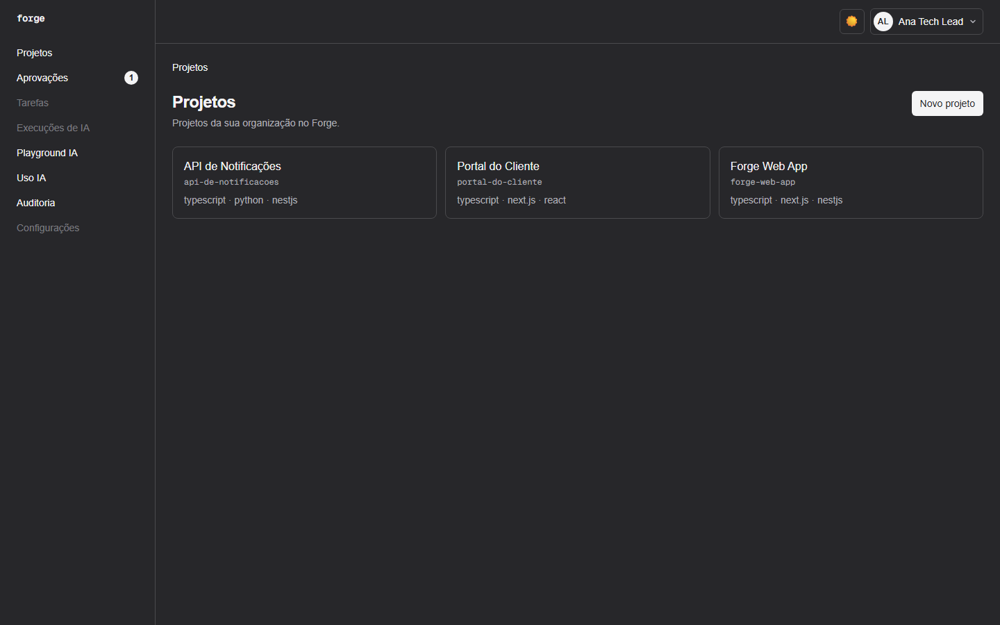

## Destaques

- **Humano no controle**: a IA planeja, inspeciona, implementa, testa e revisa; qualquer `write_file`/`apply_patch` fica em "Aguardando aprovação" até um tech lead/admin decidir. Aprovado, o patch é aplicado de verdade numa cópia isolada do repositório, e um PR é aberto (provider Git de demonstração).
- **Multi-tenant e RBAC de verdade**: toda query filtra por organização; permissões por papel (admin, tech lead, developer, QA, PM, platform engineer) validadas no backend e refletidas na UI; recurso de outro tenant responde 404 genérico.
- **Tempo real**: a timeline da execução atualiza ao vivo via SSE (proxy do Next.js repassando o stream sem buffer).
- **IA trocável por configuração**: provider `mock` determinístico por padrão (zero custo, zero rede), ou Groq/Gemini/Anthropic reais por variável de ambiente; tokens, custo e latência por chamada, série histórica e limites diários por organização e por usuário.
- **Conhecimento (RAG)**: indexação de arquivos reais, detecção de conteúdo desatualizado por hash, reindexação sob demanda e ranking híbrido (lexical + vetorial determinístico), com defesa contra prompt injection no contexto recuperado.
- **Observabilidade**: traces, métricas e logs OpenTelemetry (inclusive um span por query SQL), correlação de trace entre front-end e API, redação de dados sensíveis.
- **Qualidade**: CI no GitHub Actions (lint, typecheck, testes, build e *budgets* de bundle por rota), testes e2e reais (PGlite/Postgres e Playwright, sem mocks de banco), auditoria de acessibilidade com axe (claro e escuro) e Lighthouse.
- **Acessível e responsivo**: tema claro/escuro persistente, navegação por teclado, skip link, layout mobile com menu recolhível.

## Telas

| | |
|---|---|
| 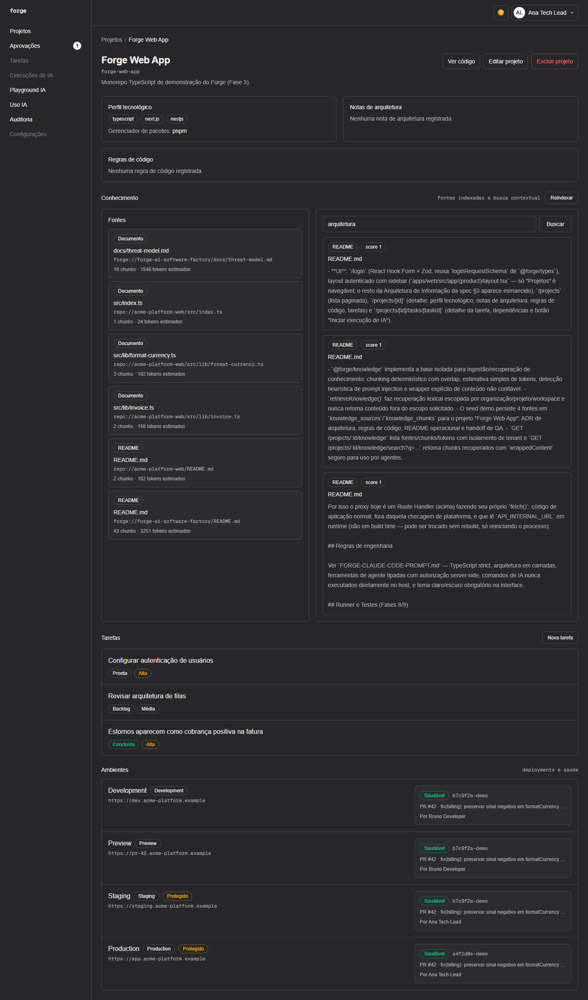 **Projeto**: perfil técnico, conhecimento indexado, tarefas e ambientes | 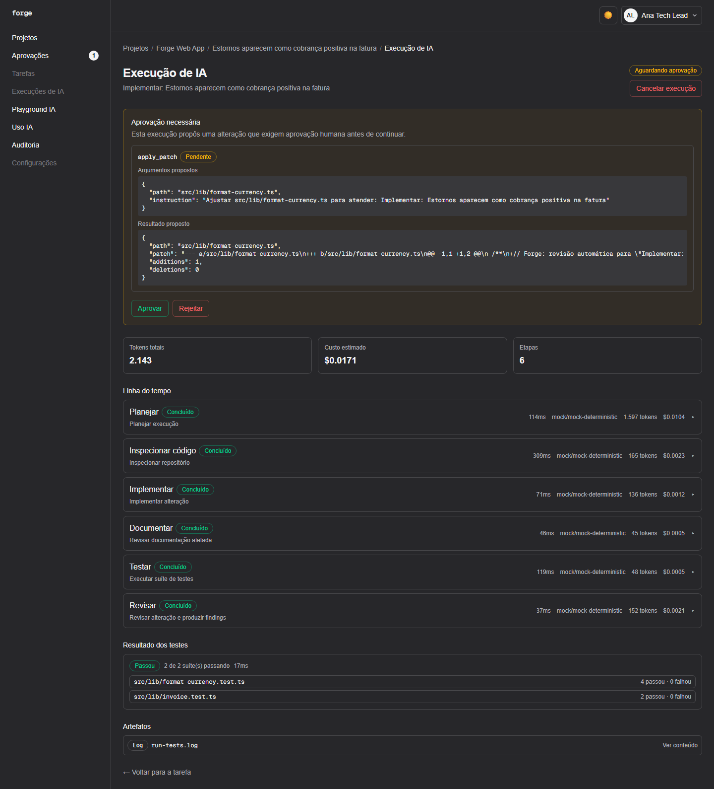 **Execução de IA** parada aguardando aprovação, com a timeline e resultado dos testes |
| 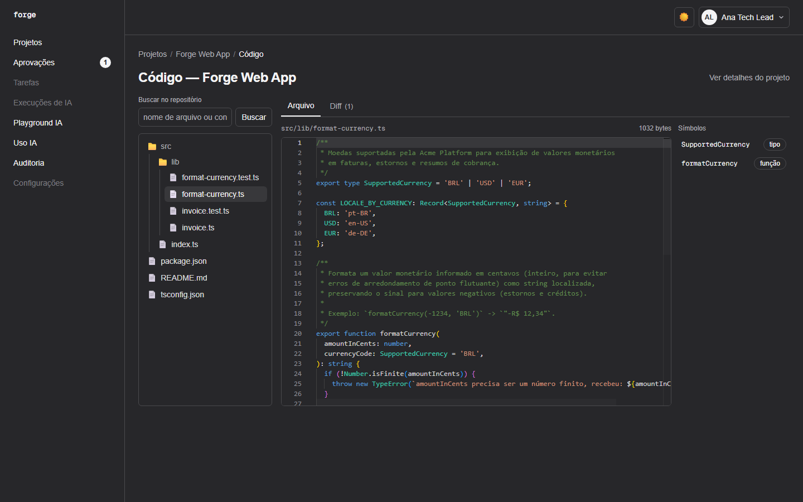 **Explorador de código** (Monaco) com símbolos e busca | 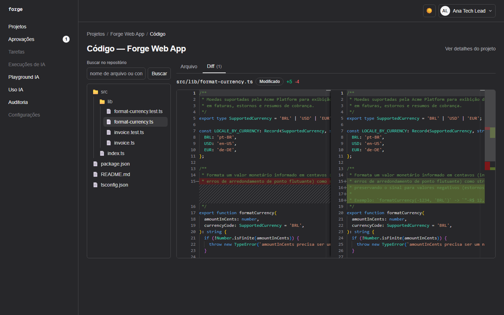 **Diff** do patch proposto pela IA |
| 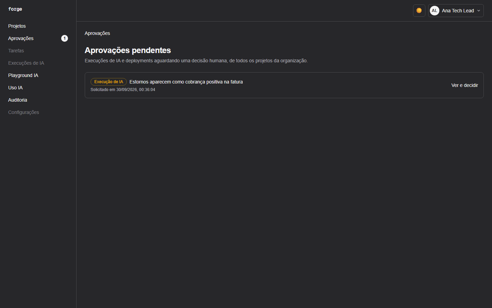 **Fila de aprovações** pendentes, com contador no menu | 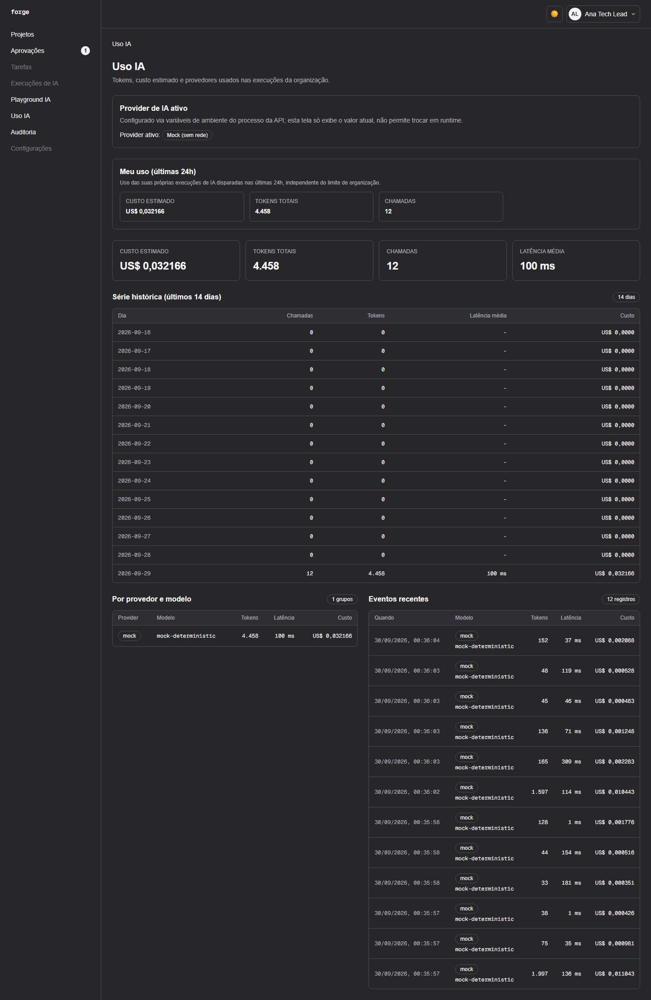 **Uso de IA**: custo, tokens, latência e série histórica |
| 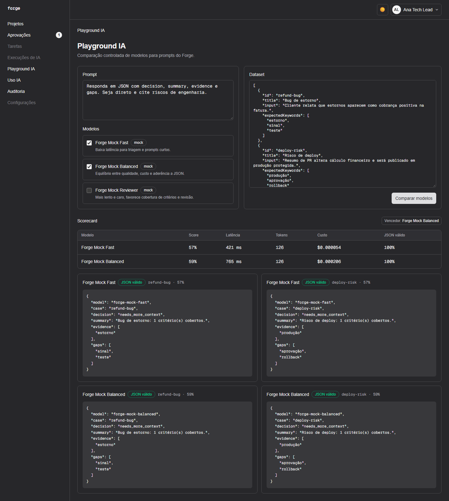 **Playground**: compara modelos com scorecard | 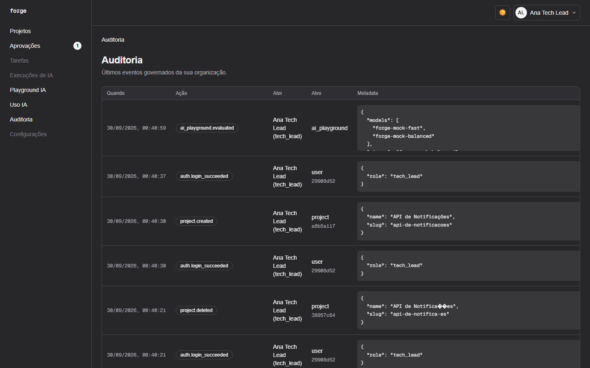 **Auditoria** de tudo que muda estado |
| 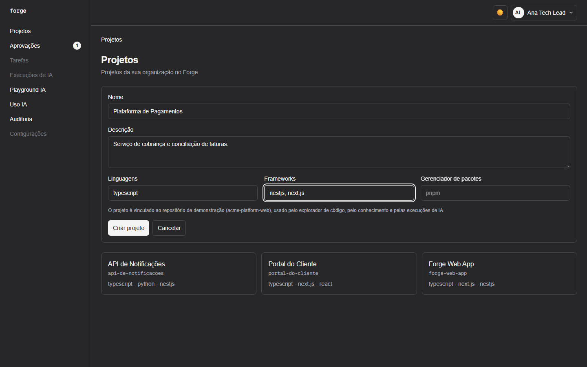 **Criar projeto** (também editar/excluir, tarefas) | 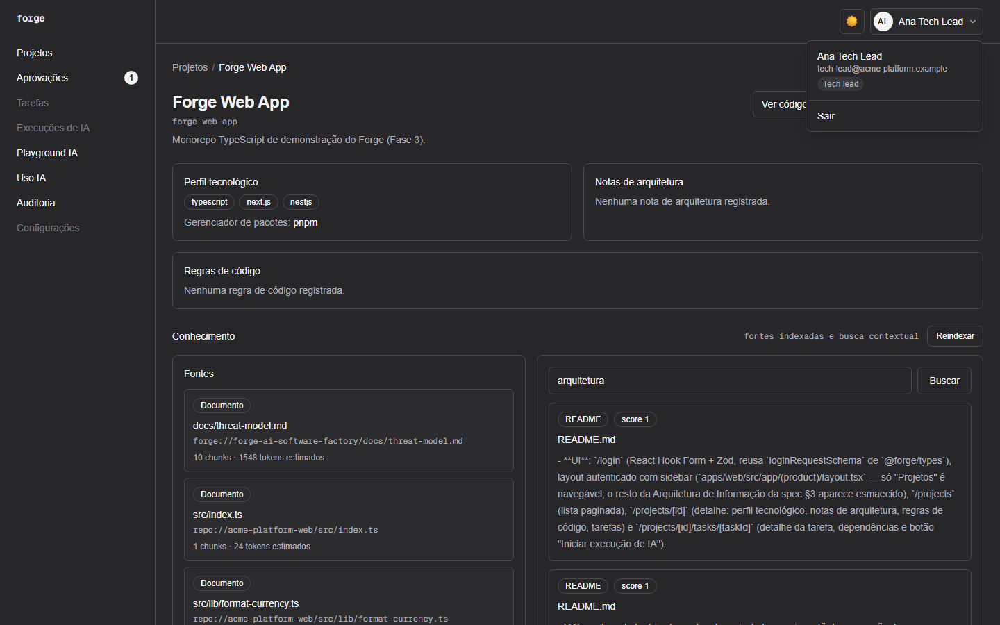 **Menu do usuário** com papel e logout |
| 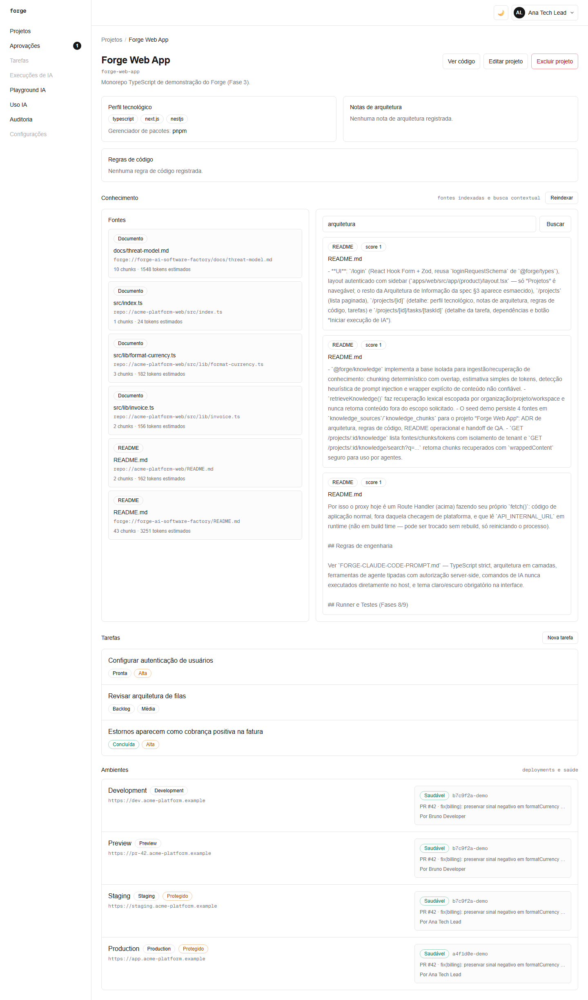 **Tema claro** | 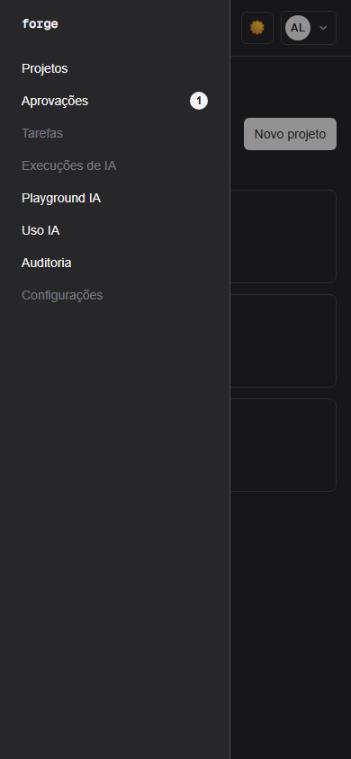 **Mobile**, menu recolhível |

Os screenshots são gerados por `pnpm --filter @forge/web screenshots` (ver `apps/web/scripts/capture-screenshots.mjs`).

## Roteiro de demonstração (5 minutos)

1. **Entre** com `tech-lead@acme-platform.example` / `demo1234` (já preenchido) e alterne o tema claro/escuro no topo; abra o **menu do usuário** (papel, e-mail, sair).
2. **Crie um projeto** ("Novo projeto"): ele nasce vinculado ao repositório de demonstração. Abra-o e crie uma **tarefa** ("Nova tarefa"); edite e exclua para ver a confirmação em duas etapas.
3. Abra a tarefa **"Estornos aparecem como cobrança positiva na fatura"** e clique em **Iniciar execução de IA**: a timeline avança ao vivo (planejar → inspecionar → implementar → documentar → testar → revisar) até **Aguardando aprovação**.
4. Veja a proposta (`apply_patch`) e **aprove**: o patch é aplicado numa cópia isolada, um PR de demonstração é aberto e tudo fica na **Auditoria**. Rejeitar leva a execução a "Falhou".
5. Em **Ver código**, navegue pela árvore, busque no repositório e veja o **diff** (o bug do `formatCurrency` perdendo o sinal de estornos).
6. Na página do projeto, use a busca em **Conhecimento** e o botão **Reindexar** (hash de conteúdo detecta o que mudou).
7. Confira **Uso IA** (custo/tokens/latência por dia), **Playground IA** (comparação de modelos) e **Auditoria**.
8. Saia e entre como `dev@acme-platform.example` / `demo1234`: os botões de aprovar, criar/editar/excluir projeto e reindexar somem — o backend responde 403 mesmo se a chamada for feita à mão.

## Arquitetura

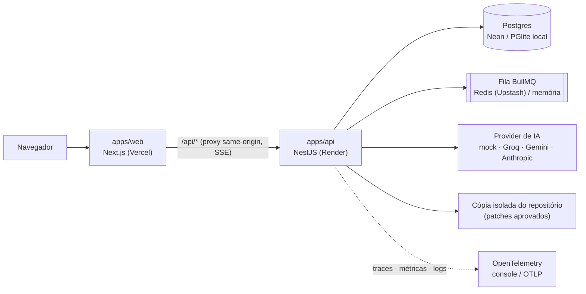

Camadas do monorepo: `types` (schemas Zod) → `domain` (regras puras: RBAC, máquinas de estado, política de ferramentas) → `database` (Drizzle) → `agents`/`ai`/`knowledge`/`git`/`sandbox`/`testing` (pacotes sem framework) → `apps/api` e `apps/web`.

## Escopo deliberado (o que é simulado, e por quê)

Por ser um projeto de portfólio público, algumas fronteiras foram decididas de propósito:

- **Deploy de ambientes**: o fluxo (gate de aprovação para ambientes protegidos, decisão, auditoria) é real; a publicação em si é simulada — não existe um app real de "Acme Platform" para publicar.
- **`run_command`/`run_tests` da IA**: continuam simulados; executar comando de verdade exige isolamento de rede (Docker), que a hospedagem gratuita não oferece. A escrita de arquivos aprovada, em compensação, é real (numa cópia descartável).
- **GitHub real**: o provider Git é um mock determinístico — nenhuma execução de IA abre PR num repositório de verdade.
- **Embeddings**: vetoriais determinísticos e locais (hashing trick), sem chamada de rede; não capturam sinonímia semântica de verdade.

A lista completa de decisões e o histórico de cada fase estão em [`PROGRESS.md`](PROGRESS.md); o deploy (Render/Vercel/Neon/Upstash) em [`docs/production-deployment.md`](docs/production-deployment.md).

## Documentação técnica

Monorepo do Forge, conforme `FORGE-SPECIFICATION.md` (produto) e `FORGE-CLAUDE-CODE-PROMPT.md` (prompt de implementação).

## Stack

pnpm + Turborepo · Next.js/React/TypeScript/Tailwind · NestJS · Drizzle ORM (Postgres) · BullMQ/Redis · Vitest · Vercel AI SDK.

## Estrutura

```
apps/
  web/        Next.js (App Router) — frontend
  api/        NestJS — backend (auth/RBAC, projects)
packages/
  types/      Schemas Zod e tipos compartilhados (inclui Permission, MemberRole)
  domain/     Lógica de domínio pura (RBAC, política de ferramentas, hash de senha)
  database/   Schema Drizzle + client (Postgres real ou PGlite local)
  sandbox/    Runner isolado (Docker quando disponível, fallback local controlado)
  testing/    Núcleo de execução/análise de suites usando SandboxRunner
  git/        Contratos Git, provider mock determinístico e fronteira GitHub injetável
  knowledge/  Chunking, recuperação lexical e defesa contra prompt injection em contexto RAG
```

Novos pacotes (`code-intelligence`, `policies`, `ui`) e apps (`runner`, `docs`) serão adicionados conforme as fases do roadmap avançam — ver `FORGE-CLAUDE-CODE-PROMPT.md`.

## Decisões de infraestrutura local (sem Docker)

Nesta máquina o Docker não está instalado. Para não bloquear o desenvolvimento, quatro decisões foram tomadas:

1. **Banco de dados**: sem `DATABASE_URL` definido, o `@forge/database` usa [PGlite](https://pglite.dev) — um Postgres real compilado para WASM, embarcado no processo, sem instalação nenhuma. O arquivo local default fica em `<repo>/.data/forge-dev.pglite`, independente do diretório de onde API, migrations ou seed rodam. O mesmo schema Drizzle roda sem alterações contra um Postgres real (`pg`) assim que `DATABASE_URL` for definido — por exemplo, Neon/Render Postgres em staging/produção.
2. **Fila/Redis**: sem `REDIS_URL` definido, a API usa uma fila em memória (`InMemoryQueueAdapter`, mesma interface do BullMQ). Com `REDIS_URL` definido, passa a usar `BullMqQueueAdapter` (BullMQ + ioredis) automaticamente.
3. **IA**: sem `AI_PROVIDER` explícito, os agentes de IA usam um adaptador mock determinístico, alinhado ao modo demo descrito na spec (§21). Para chamadas reais, configure `AI_PROVIDER=gemini` com `GEMINI_API_KEY`/`GEMINI_MODEL`, `AI_PROVIDER=groq` com `GROQ_API_KEY`/`GROQ_MODEL`, ou `AI_PROVIDER=anthropic` com `ANTHROPIC_API_KEY`/`ANTHROPIC_MODEL`.
4. **Runner/Sandbox**: `@forge/sandbox` fornece `DockerSandboxRunner` e `LocalProcessSandboxRunner`. O fallback local é útil para desenvolvimento sem Docker, mas não é isolamento de kernel; por isso segue desacoplado do orquestrador até existir fluxo de aprovação humana para ações reais.

Banco, fila e providers de IA reais não exigem mudança de código quando a infraestrutura estiver disponível — apenas variáveis de ambiente. Runner seguro para comandos/testes ainda é uma frente própria de implementação. Ver `.env.example`, `.env.production.example` e [docs/production-deployment.md](docs/production-deployment.md).

## Como rodar

```bash
pnpm install
pnpm dev          # apps/web em :3000, apps/api em :3001
```

```bash
pnpm build         # build de todos os apps/pacotes
pnpm lint          # lint em todo o monorepo
pnpm typecheck     # typecheck em todo o monorepo
pnpm test          # testes unitários/integração em todo o monorepo
```

## Banco de dados

```bash
pnpm --filter @forge/database db:generate   # gera migrações a partir do schema
pnpm db:migrate                              # aplica migrações (Postgres real ou PGlite local)
pnpm --filter @forge/database db:seed        # popula "Acme Platform" com usuários, demo, ambientes e conhecimento
```

## Como abrir a UI demo

Para ver a experiência completa sem Docker local, use o PGlite/fila em memória do modo dev:

```bash
pnpm db:migrate
pnpm --filter @forge/database db:seed
pnpm dev
```

Depois abra `http://localhost:3000`. A raiz redireciona para `/projects`; sem sessão, o proxy encaminha para `/login`.

Credenciais de demo:

- `tech-lead@acme-platform.example` / `demo1234` — vê Projetos, Playground IA, Auditoria e aprova execuções.
- `platform@acme-platform.example` / `demo1234` — gerencia ambientes e solicita deployments.
- `dev@acme-platform.example` / `demo1234` — perfil de desenvolvedor com permissões mais restritas.
- `admin@acme-platform.example` / `demo1234` — superusuário; único papel que decide o gate de aprovação de deployments protegidos.

Rotas úteis para navegar após login:

- `/projects` e `/projects/[id]` (criar/editar/excluir projeto, criar tarefa)
- `/projects/[id]/tasks/[taskId]` (editar/excluir tarefa, iniciar execução de IA) e `/projects/[id]/code`
- `/approvals`, `/ai-usage`, `/ai-playground`, `/audit-logs`

## Autenticação/RBAC (Fase 2)

- `POST /auth/login` (`{ email, password }`) retorna um JWT no corpo (`token`) e também como cookie `httpOnly` (`forge_session`, `sameSite=lax`, `secure` apenas em produção). `GET /auth/me` é protegido e retorna o usuário autenticado (sem hash de senha).
- **Credenciais de demo** (após `pnpm --filter @forge/database db:seed`, organização "Acme Platform"):
  - `tech-lead@acme-platform.example` / `demo1234` (role `tech_lead`)
  - `platform@acme-platform.example` / `demo1234` (role `platform_engineer`)
  - `dev@acme-platform.example` / `demo1234` (role `developer`)
  - `admin@acme-platform.example` / `demo1234` (role `admin`)
- `JWT_SECRET` (ver `.env.example`) tem um default óbvio e inseguro (`dev-insecure-secret-change-me`) só para não bloquear `pnpm dev` local — **defina um valor real antes de qualquer deploy**.
- RBAC: `packages/domain` define uma matriz `MemberRole -> Permission[]` fechada (`hasPermission`) e `authorizeToolCall`, que compõe isolamento de tenant + RBAC + a política de ferramentas da Fase 1 (`decideToolPolicy`) numa única decisão. Em `apps/api`, `JwtAuthGuard` + `PermissionsGuard` (decorator `@RequirePermission(...)`) aplicam isso a nível de rota — ver `GET /projects/:id` como referência mínima de isolamento de tenant de ponta a ponta.

## Projetos e Tarefas (Fase 4)

- **Proxy same-origin**: `apps/web` e `apps/api` são origens diferentes (`:3000`/`:API_PORT`) — o cookie `httpOnly forge_session` não atravessa fetch cross-origin. `apps/web/src/app/api/[...path]/route.ts` (Route Handler) repassa `/api/*` (chamado pelo browser na mesma origem do Next.js) para a API real via `fetch()` próprio, usando a env var `API_INTERNAL_URL` (default `http://127.0.0.1:3001`). Ver `.env.example`.
- **UI**: `/login` (React Hook Form + Zod, reusa `loginRequestSchema` de `@forge/types`), layout autenticado com sidebar (`apps/web/src/app/(product)/layout.tsx` — só "Projetos" é navegável; o resto da Arquitetura de Informação da spec §3 aparece esmaecido), `/projects` (lista paginada), `/projects/[id]` (detalhe: perfil tecnológico, notas de arquitetura, regras de código, tarefas) e `/projects/[id]/tasks/[taskId]` (detalhe da tarefa, dependências e botão "Iniciar execução de IA").
- **Proteção de rotas**: `apps/web/src/proxy.ts` (Next.js 16 renomeou `middleware.ts` para `proxy.ts` — mesma função) checa só a presença do cookie `forge_session` e redireciona para `/login`; é uma checagem otimista, a validação de verdade continua sendo feita pela API a cada chamada — `apps/web/src/lib/api-client.ts` redireciona para `/login` em qualquer 401.
- **Estado de servidor**: TanStack Query (`@tanstack/react-query`) para todas as chamadas à API a partir de Client Components.
- **Endpoints novos em `apps/api`** (mesmo padrão de tenant scoping + RBAC de `GET /projects/:id`): `GET /projects` (paginado, `project:read`), `GET /projects/:id/tasks` (com dependências, `project:read`), `GET /tasks/:id` (`task:read`), `POST /tasks/:id/agent-runs` (`agent_run:trigger`) — cria um `agentRun` em `status: "queued"` para um agente existente da organização (`planner`, com fallback para o primeiro agente habilitado). Nenhum step é processado — o orquestrador de verdade é a Fase 7; a execução fica parada em fila, exatamente como a spec §9 descreve o primeiro estado do ciclo.
- **Criar, editar e excluir (depois da Fase 4)**: `POST /projects` (`project:write`) cria o projeto já vinculado ao repositório demo (`provider: mock`) numa transação, com `slug` único por organização; `PATCH`/`DELETE /projects/:id` (`project:write`), `POST /projects/:id/tasks`, `PATCH`/`DELETE /tasks/:id` (`task:manage`). Tudo com audit log; a exclusão responde 409 enquanto houver execução de IA em andamento e remove, na mesma transação, as aprovações pendentes que apontam (sem FK) para as execuções/deployments apagados. O proxy `/api/*` repassa `GET`/`POST`/`PUT`/`PATCH`/`DELETE`.
- **Pegadinha real descoberta em produção (Vercel + Render)**: a primeira versão deste proxy usava `rewrites()` do `next.config.ts`. Funciona local e contra qualquer host "normal", mas a Vercel bloqueia o destino de um `rewrites()` com `DNS_HOSTNAME_RESOLVED_PRIVATE` quando o host de destino fica atrás de Cloudflare (caso do domínio público do Render) — a checagem de DNS/IP privado da própria camada de proxy da plataforma, não algo controlável via `next.config.ts`. Por isso o proxy hoje é um Route Handler (acima) fazendo seu próprio `fetch()`: código de aplicação normal, fora daquela checagem de plataforma, e que lê `API_INTERNAL_URL` em runtime (não em build time — pode ser trocado sem rebuild, só reiniciando o processo).

## Regras de engenharia

Ver `FORGE-CLAUDE-CODE-PROMPT.md` — TypeScript strict, arquitetura em camadas, ferramentas de agente tipadas com autorização server-side, comandos de IA nunca executados diretamente no host, e tema claro/escuro obrigatório na interface.

## Runner e Testes (Fases 8/9)

- `@forge/sandbox` expõe uma interface `SandboxRunner`, `DockerSandboxRunner` com limites de CPU/memória/rede/timeout e `LocalProcessSandboxRunner` com confinamento por workspace, timeout com kill de árvore de processos, env allowlist e política de comandos destrutivos compartilhada com `@forge/domain`.
- `@forge/testing` executa suites via `SandboxRunner`, deriva status apenas do resultado real do processo (`exitCode`, timeout ou bloqueio de política), gera resumo de falha e detecta histórico flaky simples.
- O step `test_engineer` já executa `run_tests` de verdade contra o repositório demo quando há fixture/repositório disponível, e o resultado é persistido em `test_runs`, `test_suites` e artefato de log visível no detalhe da execução.
- `@forge/testing` ainda não substitui essa execução do orquestrador como engine genérico de suites; conectar comandos/testes arbitrários a um runner real deve esperar isolamento seguro em staging/produção.

## Git (Fase 10)

- `@forge/git` define a interface `GitProvider` para branches, commits, diffs, pull requests e checks.
- `MockGitProvider` mantém estado em memória para modo demo e testes.
- Quando uma aprovação humana aplica `write_file`/`apply_patch` com sucesso em repositório `provider: "mock"`, o Forge cria branch/commit/PR via `MockGitProvider` e persiste `workspaces`, `file_snapshots`, `code_changes`, `diffs` e `pull_requests`.
- `GitHubGitProvider` continua como fronteira injetável; nenhuma credencial externa ou chamada real ao GitHub é usada.

## Ambientes (Fase 11)

- `GET /projects/:id/environments` lista ambientes e deployments recentes do projeto com o mesmo isolamento de tenant dos módulos anteriores.
- A página de detalhe de projeto mostra Development/Preview/Staging/Production, URL, proteção e último deployment.
- `POST /projects/:projectId/environments/:environmentId/deployments` solicita um deployment demo para papéis com `environment:deploy`.
- Ambientes não protegidos criam um deployment `succeeded` imediatamente no modo demo; ambientes protegidos criam um deployment `queued` e uma linha `approvals.pending` (`subjectType: "deployment"`), além de audit logs `deployment.requested`/`deployment.approval_required`.
- O seed demo é aditivo: se a organização "Acme Platform" já existir, `db:seed` garante os ambientes sem duplicar dados.
- A UI mostra o botão "Solicitar deploy" para `platform_engineer`/`admin` e exibe o gate "Aguardando aprovação" quando o último deployment protegido está pendente.
- `POST .../deployments/:deploymentId/approve`/`reject` decide o gate — restrito a `environment:approve_deployment`, uma permissão nova e deliberadamente **diferente** de `environment:deploy`: hoje só `platform_engineer`/`admin` solicitam deploy, e se a aprovação reaproveitasse a mesma permissão, `platform_engineer` poderia aprovar o próprio pedido. `environment:approve_deployment` fica restrita só a `admin` (ver `packages/domain/src/permissions.ts`). Aprovação conclui o deployment como `succeeded` (mesma simulação demo já usada por ambientes não-protegidos); rejeição conclui como `failed`. Audit logs `deployment.approved`/`deployment.rejected`. Ainda não há execução real em Render/Vercel — a etapa atual cobre solicitação, gate, decisão e auditoria.

## Conhecimento (Fase 12)

- `@forge/knowledge` implementa a base isolada para ingestão/recuperação de conhecimento: chunking determinístico com overlap, estimativa simples de tokens, detecção heurística de prompt injection e wrapper explícito de conteúdo não confiável.
- `retrieveKnowledge()` faz recuperação lexical escopada por organização/projeto/workspace e nunca retorna conteúdo fora do escopo solicitado.
- O seed demo persiste 4 fontes em `knowledge_sources`/`knowledge_chunks` para o projeto "Forge Web App": ADR de arquitetura, regras de código, README operacional e handoff de QA.
- `GET /projects/:id/knowledge` lista fontes/chunks/tokens com isolamento de tenant e `GET /projects/:id/knowledge/search?q=...` retorna chunks recuperados com `wrappedContent` seguro para uso por agentes.
- A tela `/projects/[id]` mostra a seção "Conhecimento" com fontes indexadas e busca contextual.
- O orquestrador recupera até 5 chunks por execução, injeta o contexto nos steps e envia o mesmo material ao provider de IA com metadados de fonte para auditoria/UI.
- Ainda não há indexador automático de repositório/docs, embeddings/vector store ou ranking semântico.

## Playground de IA (Fase 13)

- `GET /ai-playground/config` retorna catálogo de modelos mock e dataset padrão; `POST /ai-playground/evaluations` compara modelos com latência, tokens, custo estimado, validade de output estruturado e score.
- A permissão `ai_playground:use` fica restrita a `admin`, `platform_engineer` e `tech_lead`.
- A UI `/ai-playground` permite editar prompt/dataset, selecionar modelos e visualizar scorecard sem chamadas externas ou custo real.
- O orquestrador de agentes suporta providers reais por env: `AI_PROVIDER=gemini`, `AI_PROVIDER=groq` ou `AI_PROVIDER=anthropic`, mantendo `mock` como default local/teste. Cada step gerado persiste `ai_messages`/`ai_usages` com provider, modelo, tokens e custo estimado, e o detalhe do run exibe esse uso.
- `GET /ai-usage/summary` e a UI `/ai-usage` agregam tokens, chamadas, custo estimado, latência média, provider/modelo e eventos recentes por organização, com permissão `audit_log:read`.
- `AI_ORG_DAILY_TOKEN_LIMIT` e `AI_ORG_DAILY_COST_LIMIT_USD` bloqueiam novas execuções quando a organização já atingiu o teto das últimas 24h.
- Ainda faltam limites por usuário, séries históricas de latência/custo, datasets versionados, embeddings/evals avançadas e adapter Anthropic se necessário.

## Segurança e Observabilidade (Fase 14)

- [docs/threat-model.md](docs/threat-model.md) registra o threat model inicial para runner, tools, secrets, Git, contexto de IA, exports e canais realtime.
- `@forge/agents` agora emite traces estruturados para início/fim de agent steps e tool calls por meio de uma porta `AgentRunTraceSink`.
- `apps/api` injeta um sink local (`AgentRunTraceLoggerService`) que escreve eventos de trace como logs estruturados quando `FORGE_TRACE_LOGS=1`, aplicando redaction inicial de chaves sensíveis antes do log.
- A API também inicializa OpenTelemetry real em `apps/api/src/tracing.ts`: auto-instrumentação HTTP, spans manuais de `agent.step`/`tool.call`, `ConsoleSpanExporter` por padrão e OTLP opt-in via `OTEL_EXPORTER_OTLP_ENDPOINT`.
- `apps/web/src/tracing.ts` + `src/proxy.ts` propagam trace context W3C real (`traceparent`) em toda requisição que atravessa o proxy same-origin (`/api/*`) para `apps/api` — um span CLIENT mínimo (mesmo `ConsoleSpanExporter`/OTLP opt-in de `apps/api`, sem auto-instrumentar todo o Next.js) que a auto-instrumentação HTTP da API já honra como parent, correlacionando o mesmo `traceId` nos dois processos.
- `GET /audit-logs` e `/audit-logs` expõem leitura tenant-scoped dos eventos de auditoria para papéis com `audit_log:read`, sem vazar `passwordHash` do ator.
- `POST /auth/login`, `POST /tasks/:id/agent-runs`, `POST /agent-runs/:id/cancel` e `POST /ai-playground/evaluations` gravam audit logs com ator, alvo e metadados seguros (`auth.login_succeeded`, `auth.login_failed`, `agent_run.triggered`, `agent_run.cancelled`, `ai_playground.evaluated`).
- Decisões de política de tool calls que exigem aprovação ou são negadas também geram auditoria (`agent_run.policy_approval_required`/`agent_run.policy_denied`) sem registrar argumentos, patches ou conteúdo de arquivos.
- Ainda faltam métricas OTel, cobertura de audit log para mais endpoints mutáveis e dashboards/alertas.

## Performance e Acessibilidade (Fase 15)

- O layout autenticado tem skip link para o conteúdo principal, `main` identificável e foco visível consistente para links, botões e campos.
- Em viewports estreitos, a navegação autenticada vira um drawer mobile com foco gerenciado e Escape para fechar; o conteúdo principal usa largura mínima segura para evitar overflow horizontal em telas reais de telefone/tablet.
- Playwright cobre login -> layout autenticado -> navegação por teclado até o conteúdo.
- `@axe-core/playwright` roda auditoria automatizada nas rotas autenticadas principais e em estados densos: scorecard do Playground IA e timeline de execução com steps/findings/tool calls expandidos.
- `lighthouse-budgets.spec.ts` roda Lighthouse real em sessão autenticada contra `/projects`, `/projects/[id]/code` e timeline de execução, com budgets de performance/acessibilidade/best-practices. Os relatórios HTML locais ficam em `apps/web/lighthouse-reports/` e são ignorados pelo Git.
- O lint do web ignora `test-results/**` e `playwright-report/**`, evitando corrida contra artefatos efêmeros do Playwright.
- Ainda falta monitoramento contínuo em CI para budgets de bundle por chunk e refinamentos adicionais por viewport nas telas futuras.

## QA e Handoff (Fase 16)

- [PROGRESS.md](PROGRESS.md) é o mapa principal de retomada.
- [docs/final-qa-handoff.md](docs/final-qa-handoff.md) consolida validações, limites conhecidos e ordem sugerida de commits.
