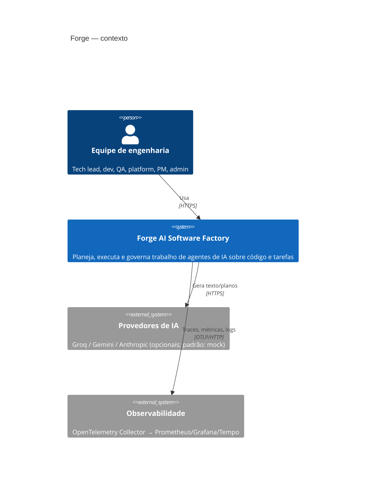
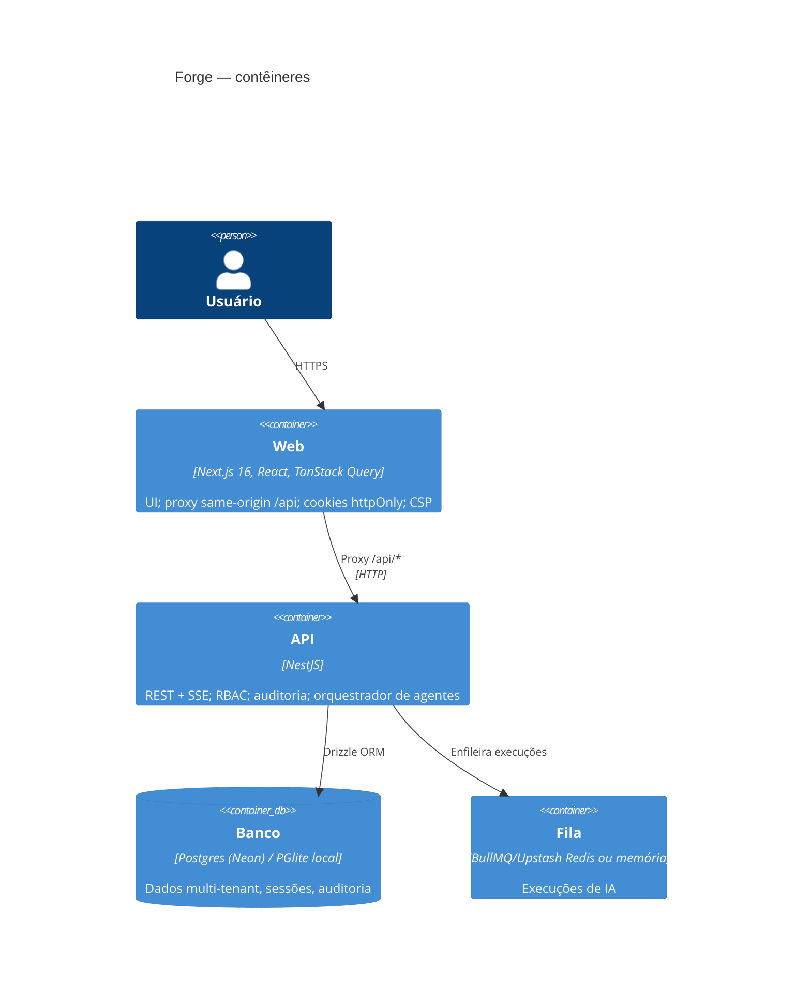
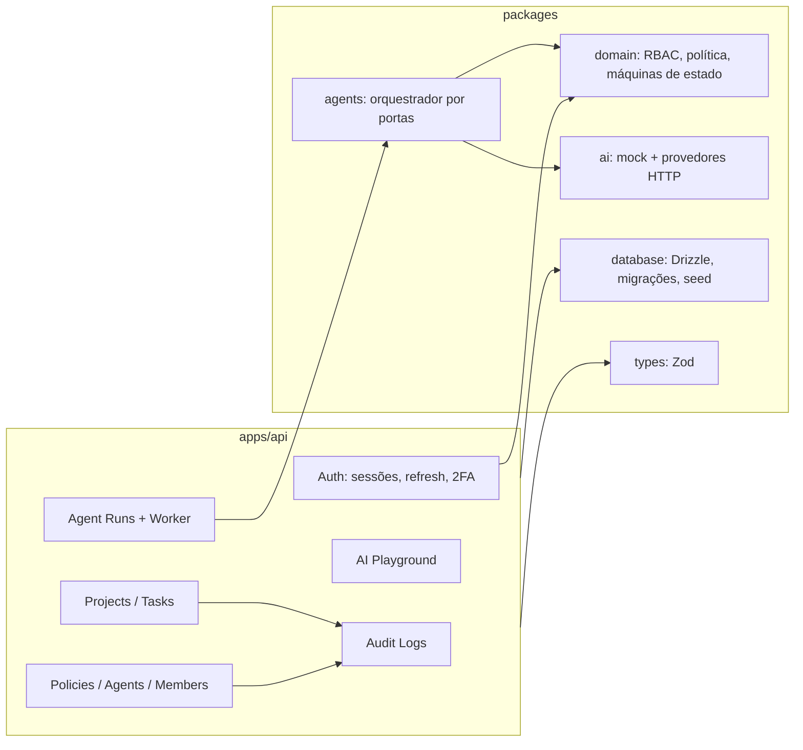
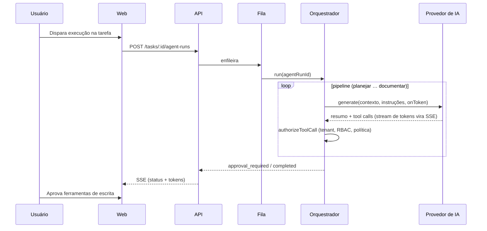

# Arquitetura (modelo C4)

## Nível 1 — Contexto

```mermaid
C4Context
  title Forge — contexto
  Person(user, "Equipe de engenharia", "Tech lead, dev, QA, platform, PM, admin")
  System(forge, "Forge AI Software Factory", "Planeja, executa e governa trabalho de agentes de IA sobre código e tarefas")
  System_Ext(llm, "Provedores de IA", "Groq / Gemini / Anthropic (opcionais; padrão: mock)")
  System_Ext(otel, "Observabilidade", "OpenTelemetry Collector → Prometheus/Grafana/Tempo")
  Rel(user, forge, "Usa", "HTTPS")
  Rel(forge, llm, "Gera texto/planos", "HTTPS")
  Rel(forge, otel, "Traces, métricas, logs", "OTLP/HTTP")
```

## Nível 2 — Contêineres

```mermaid
C4Container
  title Forge — contêineres
  Person(user, "Usuário")
  Container(web, "Web", "Next.js 16, React, TanStack Query", "UI; proxy same-origin /api; cookies httpOnly; CSP")
  Container(api, "API", "NestJS", "REST + SSE; RBAC; auditoria; orquestrador de agentes")
  ContainerDb(db, "Banco", "Postgres (Neon) / PGlite local", "Dados multi-tenant, sessões, auditoria")
  Container(queue, "Fila", "BullMQ/Upstash Redis ou memória", "Execuções de IA")
  Rel(user, web, "HTTPS")
  Rel(web, api, "Proxy /api/*", "HTTP")
  Rel(api, db, "Drizzle ORM")
  Rel(api, queue, "Enfileira execuções")
```

## Nível 3 — Componentes

```mermaid
flowchart LR
  subgraph API[apps/api]
    Auth[Auth: sessões, refresh, 2FA]
    Proj[Projects / Tasks]
    Runs[Agent Runs + Worker]
    Pol[Policies / Agents / Members]
    Play[AI Playground]
    Aud[Audit Logs]
  end
  subgraph Pkgs[packages]
    Dom[domain: RBAC, política, máquinas de estado]
    Ag[agents: orquestrador por portas]
    AI[ai: mock + provedores HTTP]
    DB[database: Drizzle, migrações, seed]
    Ty[types: Zod]
  end
  Runs --> Ag --> Dom
  Ag --> AI
  Auth --> Dom
  API --> DB
  API --> Ty
  Proj --> Aud
  Pol --> Aud
```

## Fluxo de uma execução de IA

```mermaid
sequenceDiagram
  participant U as Usuário
  participant W as Web
  participant A as API
  participant Q as Fila
  participant O as Orquestrador
  participant P as Provedor de IA
  U->>W: Dispara execução na tarefa
  W->>A: POST /tasks/:id/agent-runs
  A->>Q: enfileira
  Q->>O: run(agentRunId)
  loop pipeline (planejar … documentar)
    O->>P: generate(contexto, instruções, onToken)
    P-->>O: resumo + tool calls (stream de tokens vira SSE)
    O->>O: authorizeToolCall (tenant, RBAC, política)
  end
  O-->>A: approval_required / completed
  A-->>W: SSE (status + tokens)
  U->>W: Aprova ferramentas de escrita
```
